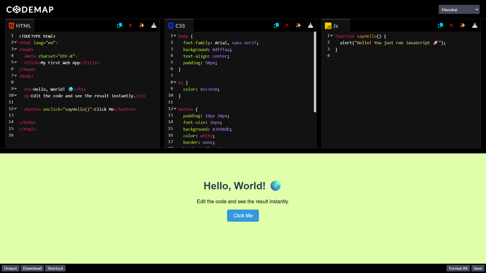
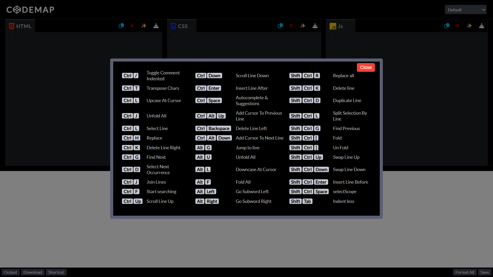

# 🖊️ CodeMap | Modern Web IDE

**CodeMap** is a high-performance, browser-based code editor designed for rapid front-end prototyping. It provides a smooth, distraction-free environment where HTML, CSS, and JavaScript work together in real-time.

> **Note:** The source code for this project is private. This repository serves as a public showcase of the live application, its features, and the technologies used to build it.

---

## ✨ Key Features

I built CodeMap with productivity in mind, including essential features for a modern development experience:

* **Live Preview**: Instantly see your output as you write code.
* **Multi-pane Editor**: Side-by-side editing for HTML, CSS, and JavaScript with resizable panels.
* **Smart Editing**: Includes syntax highlighting, auto-indentation, line wrapping, and line numbering.
* **Auto-Formatting**: Keep your code clean with built-in beautification tools.
* **Custom Themes**: Over 10+ gorgeous CodeMirror themes to match your coding style.
* **Local Storage**: Your data is safe and stored locally in your browser when you click the **Save** button.
* **Efficiency**: Features auto-closing tags and brackets to prevent syntax errors.

---

## 🛠️ Tech Stack

I leveraged modern web technologies and industry-standard libraries to create a desktop-grade experience in the browser:

* **Core**: HTML5, CSS3, and JavaScript (ES6+).
* **Editor Engine**: [CodeMirror 5](https://codemirror.net/5/) for syntax highlighting and intelligent editing.
* **Layout Logic**: [Split.js](https://split.js.org/) for dynamic, resizable editor panes.
* **UI Assets**: [FontAwesome](https://fontawesome.com/) icons and [Google Fonts](https://fonts.google.com/) for a professional look.

---

## 📁 Project Walkthrough

### 🏠 Landing Page
The landing page provides a clean entry point with quick access to the editor. It highlights why CodeMap is ideal for practicing frontend development and testing UI ideas quickly.

### 💻 Code Editor
The heart of the application. It features a triple-editor layout that feeds directly into a live preview sandbox, allowing for a seamless "write-and-see" workflow.

### ⌨️ Key Map Shortcuts
To boost productivity, I integrated a comprehensive set of keyboard shortcuts for everything from code folding and searching to advanced selection controls.

---

## 🚀 Project Status

This project is **live and operational**. It was created as a major milestone in my learning journey to master real-time web execution and complex UI state management.

---

## 👤 About Me

I'm **Animesh Gupta**, a Computer Science student at **IIIT Bhopal**, pursuing my **B.Tech in CSE (Data Science)** (2025–2029). I enjoy building real-world web projects that combine clean UI with practical functionality.

---

## 🔒 License & Usage

**All rights reserved.**
This project is a personal portfolio piece. Copying, modifying, or redistributing the code or design is strictly prohibited without explicit written permission.
You are welcome to view the project for inspiration or review it for professional/interview purposes, but using it in your own projects or sharing it as your own work is not permitted.

**CodeMap © 2026 | Made with ❤️ by Animesh Gupta**
